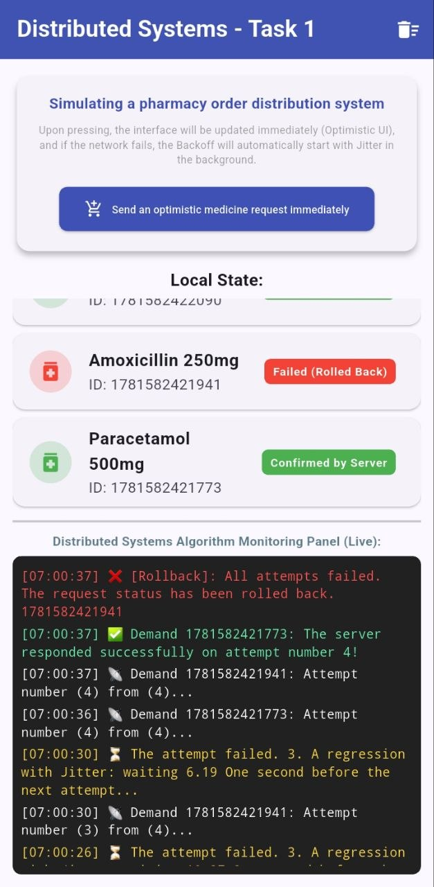
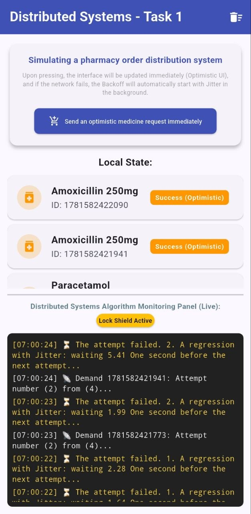
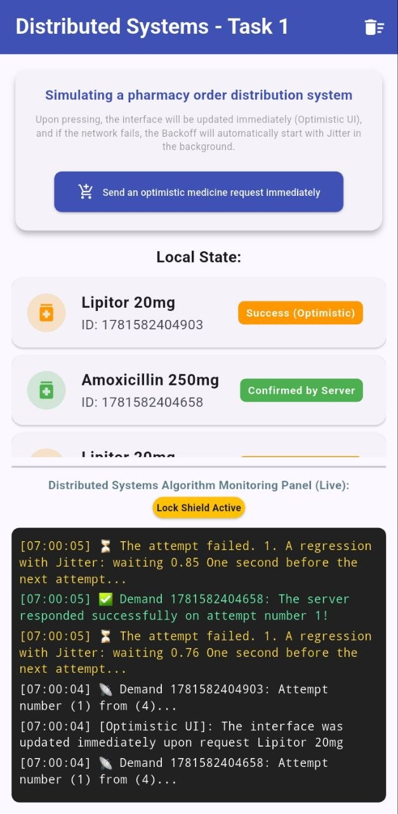
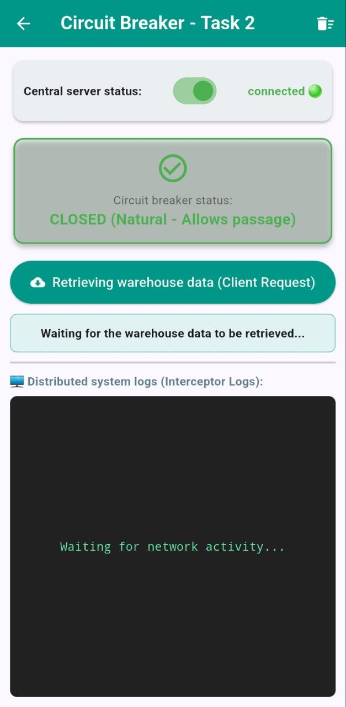
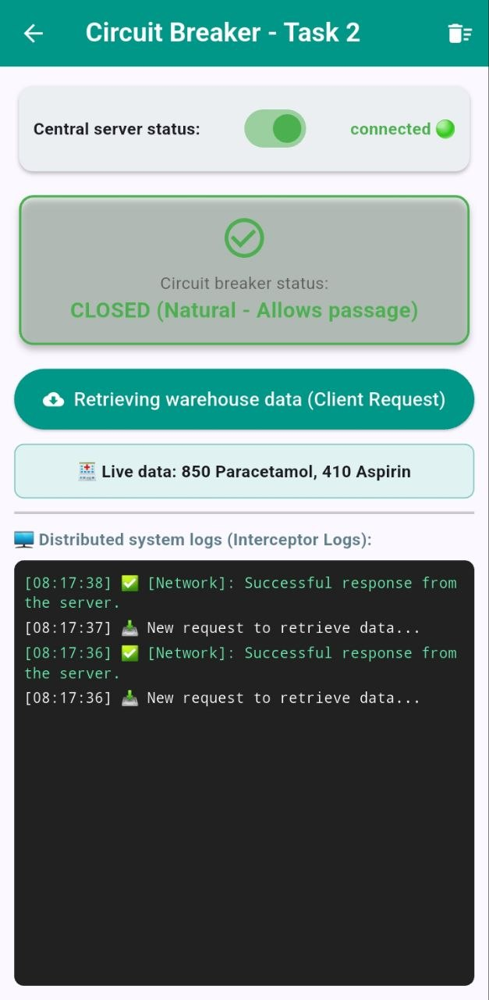
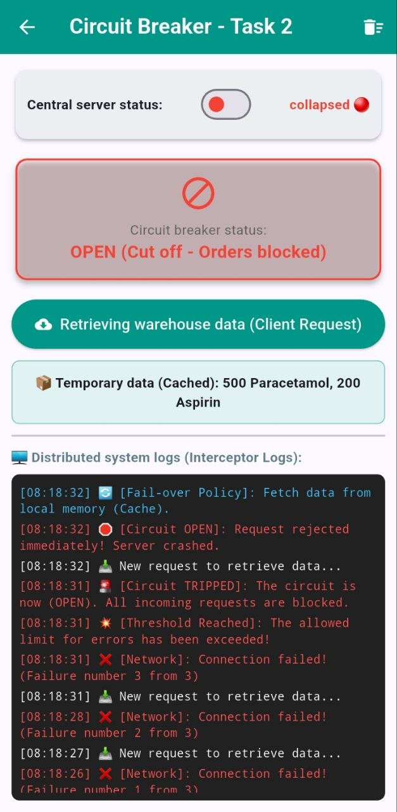
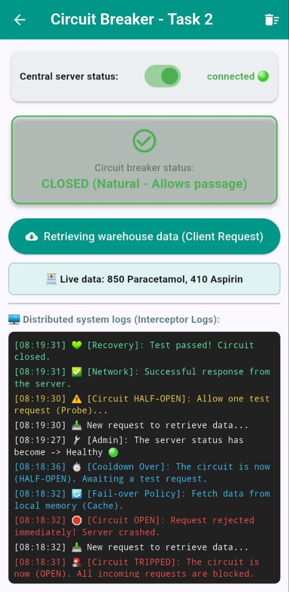
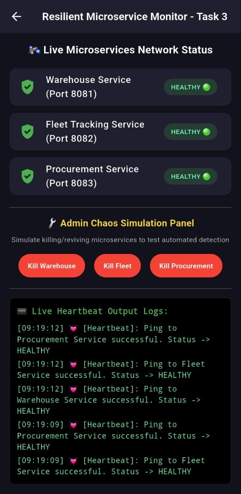

# Distributed Systems Architecture - Core Practical Tasks

This repository contains an advanced, production-grade practical implementation of key distributed systems resilience patterns. Driven by **Flutter** and reactive **GetX state management**, this centralized lab framework demonstrates client-side fault tolerance, high availability, and localized cluster telemetry monitoring.

---

### 🗺️ Project Lab Navigation Index
* **[🚀 Task 1: Client Jittered Backoff & Jitter Lock Shield](#-task 1-client-jittered-backoff--jitter-lock-shield-advanced)** (Advanced Resiliency Engine)
* **[🛠️ Task 2: Fault-Tolerant Client Interceptor Service](#%EF%B8%8F-task-2-fault-tolerant-client-interceptor-service-circuit-breaker)** (Finite State Machine Circuit Breaker)
* **[🛰️ Task 3: Resilient Microservice Heartbeat & Probing Monitor](#%F0%9F%93%A1-task-3-resilient-microservice-heartbeat--probing-monitor)** (Decoupled Background Telemetry Daemon)

---

### 🖥️ Centralized Multi-Task Lab Dashboard

Below is the core mobile architecture control layer designed to dynamically simulate client-server network chaos, failures, and recovery strategies across all implemented distributed patterns:

<p align="center">
  
</p>

---

## 🚀 Task 1: Client Jittered Backoff & Jitter Lock Shield (Advanced)

### 📌 Core Architectural Concepts

When a distributed service experiences degraded performance or a temporary outage, naive clients that aggressively retry failed requests can inadvertently cause a **Thundering Herd Problem**, generating massive traffic spikes that prevent the server from recovering. 

To mitigate this, this project implements three distributed structural patterns:

#### 1. Exponential Backoff with Full Jitter
Instead of retrying immediately or at fixed intervals, the client backs off exponentially based on the number of failed attempts. To break the synchronization of multiple concurrent clients, a randomized noise factor (**Jitter**) is introduced. 
The mathematical boundary for the wait time is calculated as:

$$Wait\ Time = Random(0, Base \times 2^{attempt})$$

* **Base Delay:** $1.5 \text{ seconds}$
* **Max Attempts:** $4$
* This flattens the concurrent request spikes (**Flattening the Spikes**) across the time domain, distributing the load smoothly on the pharmaceutical/order backend.

#### 2. Network Optimistic UI
To maintain an optimal user experience under high latency or intermittent network connectivity, the application updates the local state **immediately** upon user interaction, assuming a $100\%$ success rate. 
* **Rollback Mechanism:** If the underlying distributed network layer fails permanently after the maximum number of jittered retries, a strict state rollback (**Conflict Resolution**) is triggered, restoring the UI to its correct historical state to maintain **Eventual Consistency**.

#### 3. Jitter Lock Shield
To prevent **Race Conditions** where a user might trigger multiple mutations on the same item while a previous request is still undergoing its background backoff-retry loop, a reactive concurrency lock (**Lock Shield**) is introduced via **GetX**. It guarantees data isolation until the state is safely synchronized or rolled back.

---

### 🖥️ Implementation Specifications (Flutter & GetX)

* **State Management:** Driven by reactive programming (`RxList`, `RxMap`) via **GetX** for immediate UI synchronization.
* **Distributed Simulation Terminal:** Built an in-app real-time terminal logging subsystem that precisely documents timing, exponential step increments, jitter intervals, locking mechanisms, and rollback triggers.
* **Fault Simulation:** Implemented a non-deterministic RPC mock layer with a $75\%$ failure rate to rigorously test the client-side resiliency logic under extreme network stress.
* 
### 📸 Execution & Visual Evidence

* <p align="center">
  
  
  
</p>

### 🖥️ Real-Time Execution Trace Analysis (Live Logs)

Below is an authentic execution trace captured from the Flutter development terminal, showcasing the system's asynchronous handling of multiple concurrent pharmaceutical orders under network stress:

```text
I/flutter (31981): DISTRIBUTED_LOG: [Optimistic UI]: The interface was updated immediately upon request Panadol Extra
I/flutter (31981): DISTRIBUTED_LOG: 📡 Demand 1781583050646: Attempt number (1) from (4)...
I/flutter (31981): DISTRIBUTED_LOG: [Optimistic UI]: The interface was updated immediately upon request Lipitor 20mg
I/flutter (31981): DISTRIBUTED_LOG: 📡 Demand 1781583050848: Attempt number (1) from (4)...
I/flutter (31981): DISTRIBUTED_LOG: [Optimistic UI]: The interface was updated immediately upon request Lipitor 20mg
I/flutter (31981): DISTRIBUTED_LOG: 📡 Demand 1781583051013: Attempt number (1) from (4)...
I/flutter (31981): DISTRIBUTED_LOG: [Optimistic UI]: The interface was updated immediately upon request Panadol Extra
I/flutter (31981): DISTRIBUTED_LOG: ❌ [Rollback]: All attempts failed. The request status has been rolled back. 1781583051651

---
```
---

## 🛠️ Task 2: Fault-Tolerant Client Interceptor Service (Circuit Breaker)

### 📌 Core Architectural Concepts

In distributed microservices, cascading failures occur when a transient network outage or backend dependency failure causes recursive client requests to hang. This results in critical thread pool exhaustion, memory leakage, and network socket saturation on the client side, while simultaneously flooding an already degraded server.

To enforce computational resiliency and optimize battery/network bandwidth usage, this project implements a client-side **Circuit Breaker Interceptor Subsystem**. The interceptor manages distributed communications dynamically using a rigid **Finite State Machine (FSM)** tracking three explicit runtime domains:

```text
       +---------+      Canary Success      +--------+
  +--->|  OPEN   |------------------------->| CLOSED |
  |    +---------+                          +--------+
  |         ^                                    |
Canary      | 5-Second Cooldown                  | 3 Consecutive
Failure     | Window                             | Failures
  |         |                                    v
  |    +-----------+                        +--------+
  +----+ HALF-OPEN |                        | TRIPPED|
       +-----------+                        +--------+

```
#### 1. CLOSED State (Baseline Nominal Operation)

The distributed pharmaceutical backend ecosystem is assumed to be healthy and fully operational.

* All outbound transactional RPC/HTTP requests are routed directly to the production service endpoint.
* Internal failure telemetry is continuously monitored, while remaining below the configured failure threshold.
* No client-side interception or failover mechanisms are activated during this state.

#### 2. OPEN State (Load Shedding & Failover Execution)

The breaker transitions deterministically to the **OPEN** state after detecting **three consecutive request failures** (`maxFailures = 3`).

* **Client-Side Load Shedding:** All subsequent outbound requests are immediately short-circuited at the client boundary without generating physical network traffic.
* **Resource Protection:** Prevents unnecessary bandwidth consumption, thread exhaustion, and additional stress on an already degraded backend.
* **Failover Policy:** The subsystem automatically resolves requests using locally cached inventory data, ensuring continued application functionality in a degraded but available mode.

#### 3. HALF-OPEN State (Controlled Probing Environment)

After the expiration of a non-blocking cooldown interval of **5 seconds** (`coolDownSeconds = 5`), the state machine automatically transitions to **HALF-OPEN**.

The system permits a single isolated canary request to evaluate backend health.

* **Success Condition:** A successful probe immediately restores the circuit to the **CLOSED** state and resets all accumulated failure counters.
* **Relapse Condition:** If the probe fails, the circuit instantly re-enters the **OPEN** state and restarts the cooldown cycle.
* This controlled probing strategy prevents synchronized recovery traffic while continuously evaluating service availability.

---

### 🖥️ Technical Architecture & Reactive Bindings

* **Administrative Outage Controller:** Implemented a manual service disruption switch within the UI, enabling deterministic simulation of backend outages and recoveries for FSM validation and end-to-end resilience testing.
* **GetX Reactive State Interception:** Circuit states (`Closed`, `Open`, `Half-Open`) are bound to reactive observables (`.obs`), enabling real-time UI adaptation including state indicators, warning banners, dynamic coloring, and live operational log streaming.

### 📸 Task 2 Execution & Visual Evidence

To preserve documentation symmetry across the repository, execution screenshots are organized to demonstrate the complete operational lifecycle:

**Nominal Operation → Circuit Breaker Tripped → Local Failover Mode → Service Recovery**
* <p align="center">
  
  
  
  
</p>


### 🖥️ Real-Time Execution Trace Analysis (Circuit Logs)

Below is an authenticated operational trace captured directly from the client interceptor subsystem, illustrating failure detection, breaker activation, load-shedding behavior, failover execution, and eventual recovery through the Half-Open validation phase.
```text
I/flutter (31981): CIRCUIT_LOG: [08:30:39] 📥 New request to retrieve data...
I/flutter (31981): CIRCUIT_LOG: [08:30:39] ✅ [Network]: Successful response from the server.
I/flutter (31981): CIRCUIT_LOG: [08:30:40] 📥 New request to retrieve data...
I/flutter (31981): CIRCUIT_LOG: [08:30:40] ✅ [Network]: Successful response from the server.
I/flutter (31981): CIRCUIT_LOG: [08:31:43] 🔧 [Admin]: The server status has become -> Down 🔴
I/flutter (31981): CIRCUIT_LOG: [08:31:53] 📥 New request to retrieve data...
I/flutter (31981): CIRCUIT_LOG: [08:31:53] ❌ [Network]: Connection failed! (Failure number 1 from 3)
I/flutter (31981): CIRCUIT_LOG: [08:31:56] 📥 New request to retrieve data...
I/flutter (31981): CIRCUIT_LOG: [08:31:56] ❌ [Network]: Connection failed! (Failure number 2 from 3)
I/flutter (31981): CIRCUIT_LOG: [08:32:02] 📥 New request to retrieve data...
I/flutter (31981): CIRCUIT_LOG: [08:32:03] ❌ [Network]: Connection failed! (Failure number 3 from 3)
I/flutter (31981): CIRCUIT_LOG: [08:32:03] 💥 [Threshold Reached]: The allowed limit for errors has been exceeded!
I/flutter (31981): CIRCUIT_LOG: [08:32:03] 🚨 [Circuit TRIPPED]: The circuit is now (OPEN). All incoming requests are blocked.
I/flutter (31981): CIRCUIT_LOG: [08:32:08] ⏱️ [Cooldown Over]: The circuit is now (HALF-OPEN). Awaiting a test request. 
I/flutter (31981): CIRCUIT_LOG: [08:32:23] 📥 New request to retrieve data...
I/flutter (31981): CIRCUIT_LOG: [08:32:23] ! [Circuit HALF-OPEN]: Allow one test request (Probe)...
I/flutter (31981): CIRCUIT_LOG: [08:32:23] ❌ [Network]: Connection failed! (Failure number 4 from 3)
I/flutter (31981): CIRCUIT_LOG: [08:32:23] 💔 [Relapse]: Test failed! Reopen circuit (Circuit OPEN).
I/flutter (31981): CIRCUIT_LOG: [08:32:23] 🚨 [Circuit TRIPPED]: The circuit is now (OPEN). All incoming requests are blocked.
I/flutter (31981): CIRCUIT_LOG: [08:32:29] ⏱️ [Cooldown Over]: The circuit is now (HALF-OPEN). Awaiting a test request. 
I/flutter (31981): CIRCUIT_LOG: [08:32:40] 🔧 [Admin]: The server status has become -> Healthy 🟢
I/flutter (31981): CIRCUIT_LOG: [08:32:43] 📥 New request to retrieve data...
I/flutter (31981): CIRCUIT_LOG: [08:32:43] ! [Circuit HALF-OPEN]: Allow one test request (Probe)...
I/flutter (31981): CIRCUIT_LOG: [08:32:43] ✅ [Network]: Successful response from the server.
I/flutter (31981): CIRCUIT_LOG: [08:32:43] 💚 [Recovery]: Test passed! Circuit closed.


---
```
---

## 🛰️ Task 3: Resilient Microservice Heartbeat & Probing Monitor

### 📌 Core Architectural Concepts

In microservice-oriented architectures, determining the immediate availability of decentralized downstream dependencies is crucial to preventing silent service degradation. Naive connection monitoring can over-saturate networks, while late detection leads to data black holes.

To decouple network telemetry from user-driven runtime paths, this project implements a **Resilient Heartbeat & Active Probing Monitor**. The system models a real-time health daemon tracking multiple mock microservices concurrently via a background daemon loop, executing according to strict distributed telemetry boundaries:

```text
  [ Client Dashboard Daemon ]
              │
              ├───( Every 3s: HTTP GET / )───> [ Port 8081: Warehouse Service ]   ──> HEALTHY 🟢
              │
              ├───( Every 3s: HTTP GET / )───> [ Port 8082: Fleet Service ]       ──> HEALTHY 🟢
              │
              └───( Every 3s: HTTP GET / )───> [ Port 8083: Procurement Service ] ──> DEAD 🔴 (Stopped)
```
### 📌 Core Architectural Concepts

#### 1. Periodic Active Probing (Heartbeat Thread)

The client monitoring subsystem maintains an asynchronous background heartbeat process that continuously probes all registered microservice endpoints at a fixed interval:

$$
\Delta t = 3 \text{ seconds}
$$

Each probe attempts to establish a transport-layer connection and validate service responsiveness.

To guarantee rapid fault detection and prevent client-side resource starvation, the network timeout threshold is strictly bounded:

$$
\tau_{network} \leq 2 \text{ seconds}
$$

Any endpoint failing to respond within the allocated timeout window is immediately classified as unavailable.

This strategy prevents socket exhaustion, blocked I/O operations, and thread pool congestion when interacting with crashed or unreachable services.

#### 2. Fault Isolation & Health Demarcation

The monitoring engine maintains an independent health profile for each microservice instance.

**HEALTHY 🟢**

* Successfully completes the transport-layer handshake.
* Returns a valid HTTP `200 OK` response.
* Produces the expected heartbeat payload (`PONG`).

**DEAD 🔴**

* Connection timeout exceeds the configured threshold.
* Transport-layer connection reset occurs.
* Administrative shutdown returns an HTTP `503 Service Unavailable` response.

The architecture enforces complete fault isolation between monitored services. Failure of a single node does not influence heartbeat evaluation, telemetry collection, or routing decisions associated with neighboring nodes.

#### 3. Controlled Chaos Simulation (Failure Injector)

To emulate realistic distributed infrastructure failures, the monitoring dashboard incorporates administrative control switches capable of selectively terminating and restoring individual backend nodes.

Supported simulation targets include:

* Port 8081
* Port 8082
* Port 8083

This mechanism functions as a lightweight chaos-engineering environment, enabling validation of automatic fault detection, service recovery, and monitoring resilience under controlled failure conditions.

---

### 🖥️ Implementation Specifications (Flutter & GetX Daemon)

* **Multi-Port Backend Simulation:** Leveraged Dart's embedded `HttpServer` infrastructure to instantiate and manage three independent microservice instances concurrently within the local execution environment.
* **Reactive Telemetry Interception:** Service health indicators (`isHealthy`, `statusText`, `logs`) are fully synchronized through GetX reactive observables (`.obs`), providing instantaneous dashboard updates without manual UI refresh operations.
* **Background Monitoring Daemon:** Heartbeat scheduling and health evaluation execute continuously in the background, ensuring near real-time visibility into service availability.

---

### 📸 Task 3 Execution & Visual Evidence
* <p align="center">
  
  
  
  
  
</p>

To demonstrate monitoring precision and recovery behavior, screenshots capture the complete operational lifecycle:

**Full Cluster Stability → Targeted Node Failure → Automated Detection → Service Restoration**

---

### 🖥️ Real-Time Execution Trace Analysis (Heartbeat Logs)

Below is an authentic execution trace captured from the integrated monitoring terminal, illustrating periodic heartbeat probes, immediate fault identification, service state transitions, and automated recovery recognition following administrative chaos injections.

```text
I/flutter (31981): HEARTBEAT_LOG: [09:22:28] ⚙️ [System]: 3 Microservices started in background.
I/flutter (31981): HEARTBEAT_LOG: [09:22:31] 💓 [Heartbeat]: Ping to Warehouse Service successful. Status -> HEALTHY
I/flutter (31981): HEARTBEAT_LOG: [09:22:31] 💓 [Heartbeat]: Ping to Fleet Service successful. Status -> HEALTHY
I/flutter (31981): HEARTBEAT_LOG: [09:22:31] 💓 [Heartbeat]: Ping to Procurement Service successful. Status -> HEALTHY
I/flutter (31981): HEARTBEAT_LOG: [09:22:46] 🔧 [Admin]: Toggled Warehouse Service to OFF
I/flutter (31981): HEARTBEAT_LOG: [09:22:49] 🚨 [Monitor]: Warehouse Service is not responding! Status -> DEAD
I/flutter (31981): HEARTBEAT_LOG: [09:22:49] 💓 [Heartbeat]: Ping to Fleet Service successful. Status -> HEALTHY
I/flutter (31981): HEARTBEAT_LOG: [09:22:49] 💓 [Heartbeat]: Ping to Procurement Service successful. Status -> HEALTHY
I/flutter (31981): HEARTBEAT_LOG: [09:22:52] 🚨 [Monitor]: Warehouse Service is not responding! Status -> DEAD
I/flutter (31981): HEARTBEAT_LOG: [09:22:52] 💓 [Heartbeat]: Ping to Fleet Service successful. Status -> HEALTHY
I/flutter (31981): HEARTBEAT_LOG: [09:22:52] 💓 [Heartbeat]: Ping to Procurement Service successful. Status -> HEALTHY
I/flutter (31981): HEARTBEAT_LOG: [09:22:55] 🚨 [Monitor]: Warehouse Service is not responding! Status -> DEAD
I/flutter (31981): HEARTBEAT_LOG: [09:22:55] 💓 [Heartbeat]: Ping to Fleet Service successful. Status -> HEALTHY
I/flutter (31981): HEARTBEAT_LOG: [09:22:55] 💓 [Heartbeat]: Ping to Procurement Service successful. Status -> HEALTHY
I/flutter (31981): HEARTBEAT_LOG: [09:22:58] 🚨 [Monitor]: Warehouse Service is not responding! Status -> DEAD
I/flutter (31981): HEARTBEAT_LOG: [09:22:58] 💓 [Heartbeat]: Ping to Fleet Service successful. Status -> HEALTHY
I/flutter (31981): HEARTBEAT_LOG: [09:22:58] 💓 [Heartbeat]: Ping to Procurement Service successful. Status -> HEALTHY
I/flutter (31981): HEARTBEAT_LOG: [09:23:01] 🚨 [Monitor]: Warehouse Service is not responding! Status -> DEAD
I/flutter (31981): HEARTBEAT_LOG: [09:23:01] 💓 [Heartbeat]: Ping to Fleet Service successful. Status -> HEALTHY
I/flutter (31981): HEARTBEAT_LOG: [09:23:01] 💓 [Heartbeat]: Ping to Procurement Service successful. Status -> HEALTHY
I/flutter (31981): HEARTBEAT_LOG: [09:23:04] 🚨 [Monitor]: Warehouse Service is not responding! Status -> DEAD
I/flutter (31981): HEARTBEAT_LOG: [09:23:04] 💓 [Heartbeat]: Ping to Fleet Service successful. Status -> HEALTHY
I/flutter (31981): HEARTBEAT_LOG: [09:23:04] 💓 [Heartbeat]: Ping to Procurement Service successful. Status -> HEALTHY
I/flutter (31981): HEARTBEAT_LOG: [09:23:05] 🔧 [Admin]: Toggled Fleet Service to OFF
I/flutter (31981): HEARTBEAT_LOG: [09:23:07] 🚨 [Monitor]: Warehouse Service is not responding! Status -> DEAD
I/flutter (31981): HEARTBEAT_LOG: [09:23:07] 🚨 [Monitor]: Fleet Service is not responding! Status -> DEAD
I/flutter (31981): HEARTBEAT_LOG: [09:23:07] 💓 [Heartbeat]: Ping to Procurement Service successful. Status -> HEALTHY
I/flutter (31981): HEARTBEAT_LOG: [09:23:17] 🔧 [Admin]: Toggled Fleet Service to ON
I/flutter (31981): HEARTBEAT_LOG: [09:23:18] 🔧 [Admin]: Toggled Warehouse Service to ON
I/flutter (31981): HEARTBEAT_LOG: [09:23:19] 💓 [Heartbeat]: Ping to Warehouse Service successful. Status -> HEALTHY
I/flutter (31981): HEARTBEAT_LOG: [09:23:19] 💓 [Heartbeat]: Ping to Fleet Service successful. Status -> HEALTHY
I/flutter (31981): HEARTBEAT_LOG: [09:23:19] 💓 [Heartbeat]: Ping to Procurement Service successful. Status -> HEALTHY
I/flutter (31981): HEARTBEAT_LOG: [09:23:22] 💓 [Heartbeat]: Ping to Warehouse Service successful. Status -> HEALTHY


---
```

